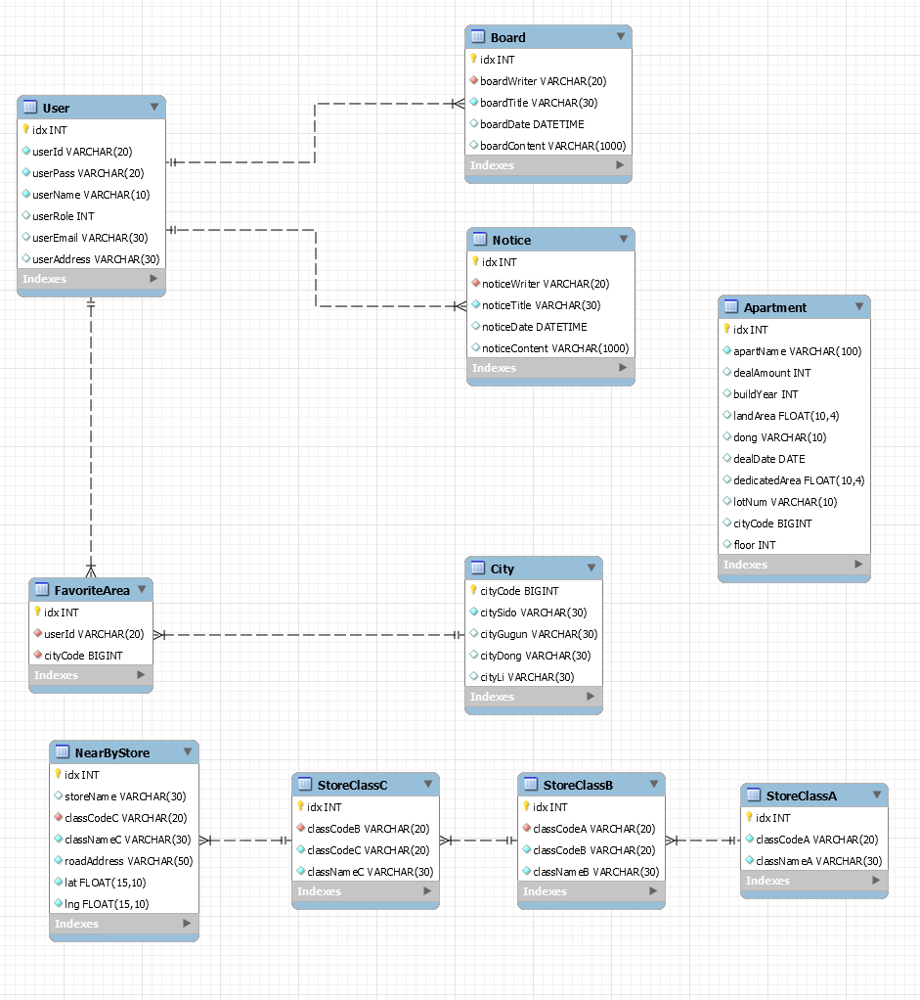
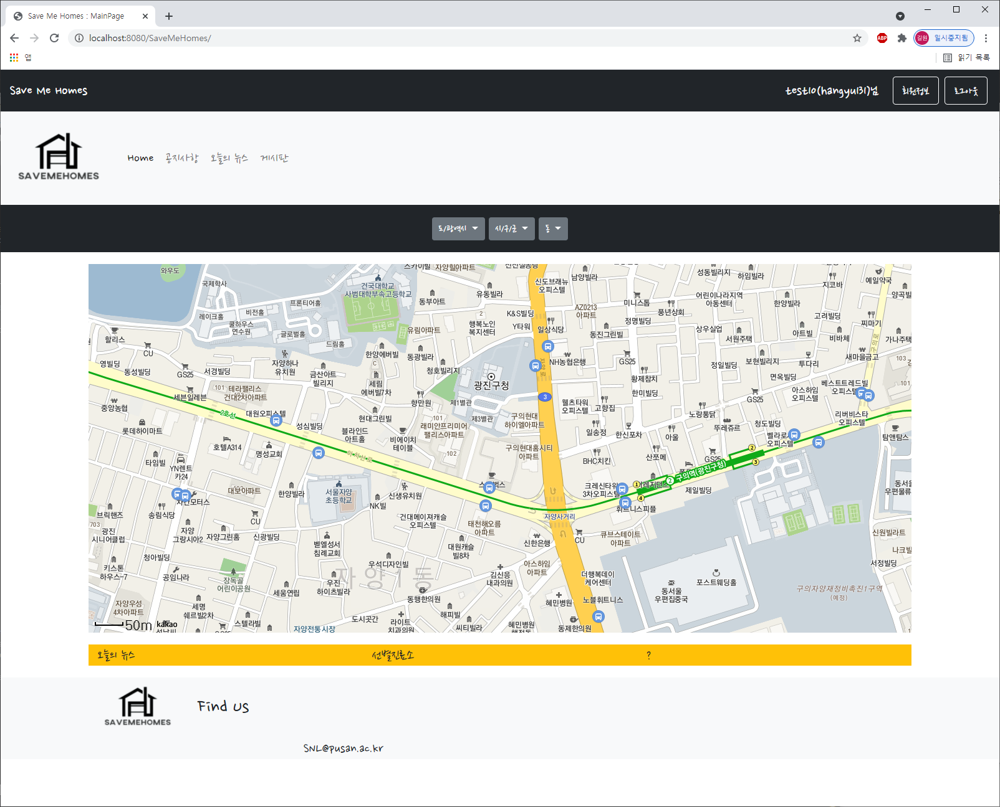

# Save Me Homes

> 지역 별 부동산 매매 내역 검색 서비스

### 개발환경

* Back-End : `MySQL`, `Java Servlet`

* Front-End : `JSP`

* Cloud : `AWS EC2`

### How To Build

`com.snl.savemehomes.constants.Constants.java` 파일 생성

```java
package com.snl.savemehomes.constants;

public class Constants {
    private static final String URL = "";
    
    // Kakao map api key
    private static final String MapAPIKey = "";
    
    // MySQL 
    private static final String DBURL = "";
    private static final String DBID = "";
    private static final String DBPASSWORD = "";
   
    public static String getUrl() {
        return URL;
    }
    public static String getMapAPIKey() {
        return MapAPIKey;
    }
    
    public static String getDBURL() {
      return DBURL;
    }
    public static String getDBID() {
      return DBID;
    }
    public static String getDBPASSWORD() {
      return DBPASSWORD;
    }
    

}
```


### ER-Diagram




### 🎬 시연 동영상

##### ⬇Click⬇

[](https://youtu.be/MoNK_vwkxrM)